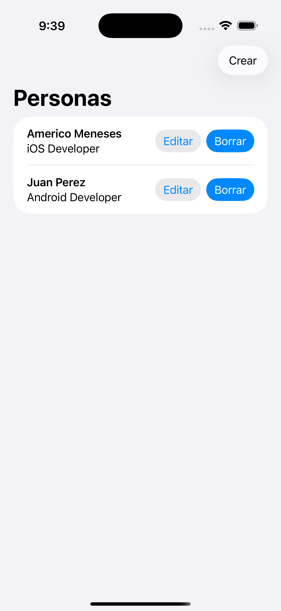
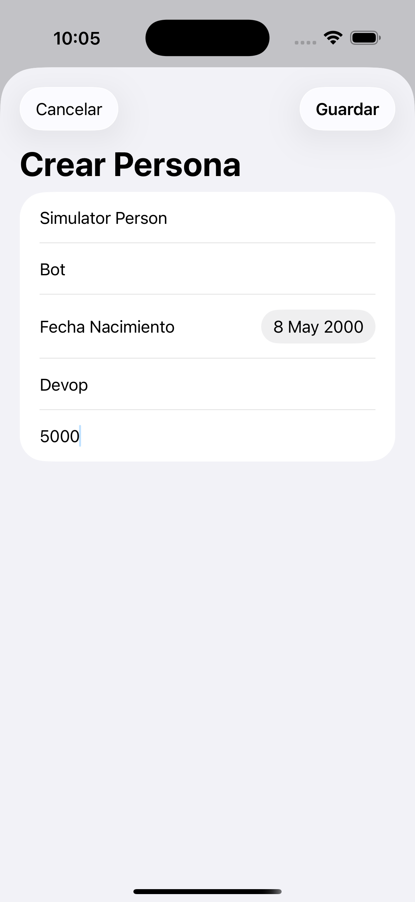
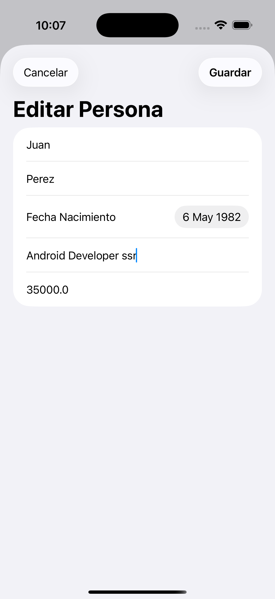

# tesffullstack

# frontend_meneses

Aplicación iOS desarrollada en **SwiftUI** que consume un servicio REST creado en Spring Boot para la gestión de personas (CRUD).

---

# Descripción

La aplicación permite:

- Visualizar listado de personas
- Crear nuevas personas
- Editar personas existentes
- Eliminar personas
- Consumir API REST desarrollada en Spring Boot
- Mostrar información almacenada en MySQL

Se implementó el patrón de arquitectura **MVVM (Model – View – ViewModel)**.

---

# Requisitos

Antes de ejecutar el proyecto asegúrate de tener instalado:

- Xcode 15+
- Swift 5+
- macOS
- Backend Spring Boot ejecutándose en: http://localhost:8080

## Evidencias de Funcionamiento

A continuación se muestran las pantallas del funcionamiento de la aplicacion.

* 

* 

* 

